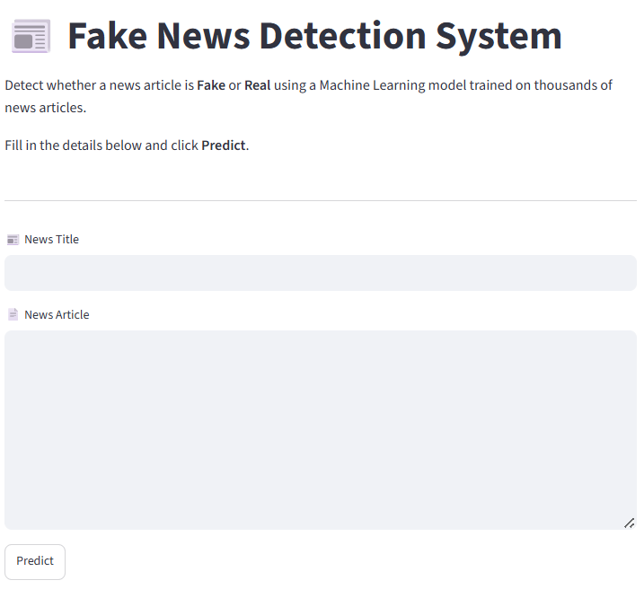

# 📰 Fake News Detection using Machine Learning

## 📌 Project Overview

This project is a Machine Learning-based Fake News Detection System that classifies news articles as **Fake** or **Real**.

The model is trained on a real-world dataset containing fake and genuine news articles. Various Machine Learning algorithms were implemented and compared using multiple evaluation metrics.

An interactive **Streamlit web application** allows users to enter news articles and receive instant predictions.

---

## 🚀 Features

- Exploratory Data Analysis (EDA)
- Text Preprocessing using NLTK
- TF-IDF Feature Extraction
- Multiple Machine Learning Models
- Model Performance Comparison
- Interactive Streamlit Web App
- Fake/Real News Prediction

---

## 🛠️ Technologies Used

- Python
- Pandas
- NumPy
- Scikit-learn
- NLTK
- Matplotlib
- Seaborn
- Streamlit
- Joblib

---

## 🤖 Machine Learning Models

The following machine learning models were trained and evaluated:

- Logistic Regression
- Naive Bayes
- Decision Tree
- Random Forest ⭐ (Best Performing Model)
- Linear Support Vector Machine (SVM)

---

## 📊 Evaluation Metrics

The models were evaluated using the following metrics:

- Accuracy
- Precision
- Recall
- F1-Score

---

## 📁 Project Structure

```text
Fake-News-Detection/
│
├── app.py
├── train.py
├── README.md
├── requirements.txt
├── .gitignore
│
├── data/
│   ├── Fake.csv
│   └── True.csv
│
├── models/
│   ├── fake_news_model.pkl
│   └── tfidf_vectorizer.pkl
│
├── notebooks/
│   └── EDA.ipynb
│
├── Screenshots/
│   ├── home.png
    └── prediction.png

---

## 📂 Dataset Information

The project uses the following datasets:

- **Fake.csv** – Contains fake news articles.
- **True.csv** – Contains real news articles.

> **Note:** `news.csv` and `clean_news.csv` are generated during data preprocessing and are intentionally excluded from the GitHub repository because they exceed GitHub's file size limits. These files can be regenerated by running the preprocessing notebook or the training script.

---

## ⚠️ Model Limitations

This project is intended for educational purposes and is trained on the **Fake and True News Dataset**. Like many machine learning classifiers, the model performs best on news articles that are similar to the training data.

As a result, predictions on arbitrary news articles, very short text snippets, or content from unseen sources may not always be accurate. The model should be considered a demonstration of text classification techniques rather than a real-world fact-checking system.

---

## ▶️ Run Locally

### Clone the repository

```bash
git clone https://github.com/harshitdubey07/Fake-News-Detection.git
```

### Navigate to the project folder

```bash
cd Fake-News-Detection
```

### Install dependencies

```bash
pip install -r requirements.txt
```

### Run the Streamlit application

```bash
streamlit run app.py
```

---

## 📷 Screenshots

### 🏠 Home Page



### 🔍 Prediction Result


---

## 📌 Future Improvements

- Deep Learning models (LSTM/BERT)
- Explainable AI using LIME or SHAP
- News URL verification
- Improved Streamlit user interface
- Multi-language fake news detection

---

## 👨‍💻 Author

**Harshit Dubey**

Machine Learning Enthusiast

GitHub: https://github.com/harshitdubey07